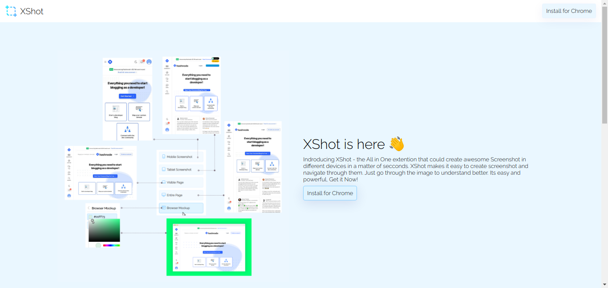

# SmartQR
Grab Awesome Screenshots in different devices.

## Inspiration

It took a lot of time and effort to build this but actually if you have the best API and resources, we could build the app within 7 days. What inspired me to build this one was that, To showcase my app and share to others, I constantly used many screenshot chrome extention, mainly [Scrn.li](http://scrnli.com/install-app). But, Still I faced many difficulties that is, There is big need to show others that our app is responsive over many devices, as a proof we take screenshot of mobile sizes and that is really a difficult task to take mobile screenshots on Laptop.

But Sadly,
**There are no Chrome Extentions that offer you to take screenshot over different devices**

And that is where the Idea came up and that end in the development of XShot. Xshot does all the Job. 

## What it does
XShot is a simple, easier, fast, minimal Screenshot taking chrome extention. Some Extrordinary features like taking screenshots from different devices like **Phone**, **Laptop**, **Tablet** make the app totally different and powerful from Others. Here are the awesome features of the app, more are on the way!

1. Take Screenshots as a **mobile device**
1. Take Screenshots as a **tablet device**
1. Take **Visible Page Screenshots**
1. Take Awesome **Full Page Screenshots**
1. Take Screenshots with **Browser mockup**
1. Minimal **Soft UI**
1. **Fast** and **Efficient**
1. Ability **Choose Background Color** for Mockup
1. Forever **Opensource**
1. **New Features** are on the way

Project Website: [https://xshot.vercel.app/](https://xshot.vercel.app/)  
Install Chrome Extention ✨: [INSTALL_EXTENTION.md](./chrome-extention/INSTALL_CHROME_EXTENTION.md)

## Install Chrome Extention
Currently, I haven't hosted the extention on Chrome Web Store, but you can expect it after the development is fully complete.

If you're interested you could use it by following the [INSTALL_EXTENTION.md](https://github.com/divyaxavier/SmartQR/blob/main/extention/INSTALL_EXTENTION.md). Thanks

## How I built it
To build the extention, the most time consumed step was to find the best and the productive API to make the extention work. After finding the API, I started creating a UI for the extention and then coded it. After that I developed a website with Soft UI to showcase the project.

## Challenges I ran into
I was hit by a lot of error and challenges. The most hard one was that the API was not working correctly as per my need. Literally I have gone through more that 20 APIs from the Internet and tried over 7 of the best one and at last I ended up on this API. I got to find the my code not working, I cried to the devs of staoverflow and they helped, I asked my friend the difficulties they face to get Ideas. It took much time to make all the awesome features and making it work. I had to spend many time to make the website fully responsive. I too had to struggle with the color and UI for the app. Finally, I did it.

## Accomplishments that I'm proud of
I am really proud that I did coded a very productive, unique chrome extention that have many extraordinary features. This the biggest, productive chrome extention that I have ever developed.  

## What I learned
Actually I have so happy that I have learned to use differnt APIs and libraries. I was mainly working on CSS and Javascript, But this project helped me to go deep into the topic. I watched many tutorials on Youtube to solve my many errors.

## What's next for SmartQR
Hey, XShot is never stoping, It is growing bigger and powerful day by day, Here are some of the possible feature that you could expect in the following days.
- Work on Right Click
- Ability to take screenshot of select area
- Feature of taking screenshot of the whole computer screen
- Feature to take Mobile screenshot of **Mockup**
- Feature to take Tablet screenshot of **Mockup**
- Different types of mockup themes, user could choose on their wish
- Dynamic UI for the APP
- Make the extention available in the Chrome Web Store, Firefox Addons and Microsoft Edge Addons.

## Contributing
Feel free to open an Issue or pull request. Make you Pull Request now and help the project grow.

**Licensed Under [MIT](https://github.com/sanvimerin/XShot/blob/main/LICENSE)**

### Star the Project 🌟